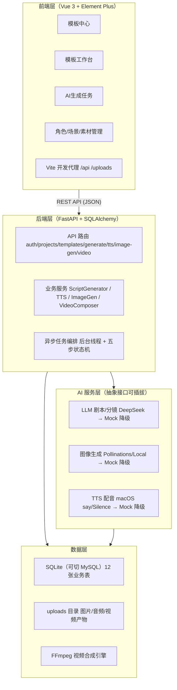

# 图 3-1 系统架构图（mermaid 源码，复制到 https://mermaid.live 导出 PNG 为 architecture.png）

```mermaid
flowchart TB
    subgraph FE["前端层（Vue 3 + Element Plus）"]
        F1["模板中心"]
        F2["模板工作台"]
        F3["AI生成任务"]
        F4["角色/场景/素材管理"]
        F5["Vite 开发代理 /api /uploads"]
    end

    subgraph BE["后端层（FastAPI + SQLAlchemy）"]
        R1["API 路由 auth/projects/templates/generate/tts/image-gen/video"]
        R2["业务服务 ScriptGenerator / TTS / ImageGen / VideoComposer"]
        R3["异步任务编排 后台线程 + 五步状态机"]
    end

    subgraph AI["AI 服务层（抽象接口可插拔）"]
        A1["LLM 剧本/分镜 DeepSeek → Mock 降级"]
        A2["图像生成 Pollinations/Local → Mock 降级"]
        A3["TTS 配音 macOS say/Silence → Mock 降级"]
    end

    subgraph DB["数据层"]
        D1["SQLite（可切 MySQL）12 张业务表"]
        D2["uploads 目录 图片/音频/视频产物"]
        D3["FFmpeg 视频合成引擎"]
    end

    FE -- "REST API (JSON)" --> BE
    BE --> AI
    BE --> DB
    AI --> DB
```
