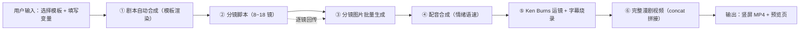
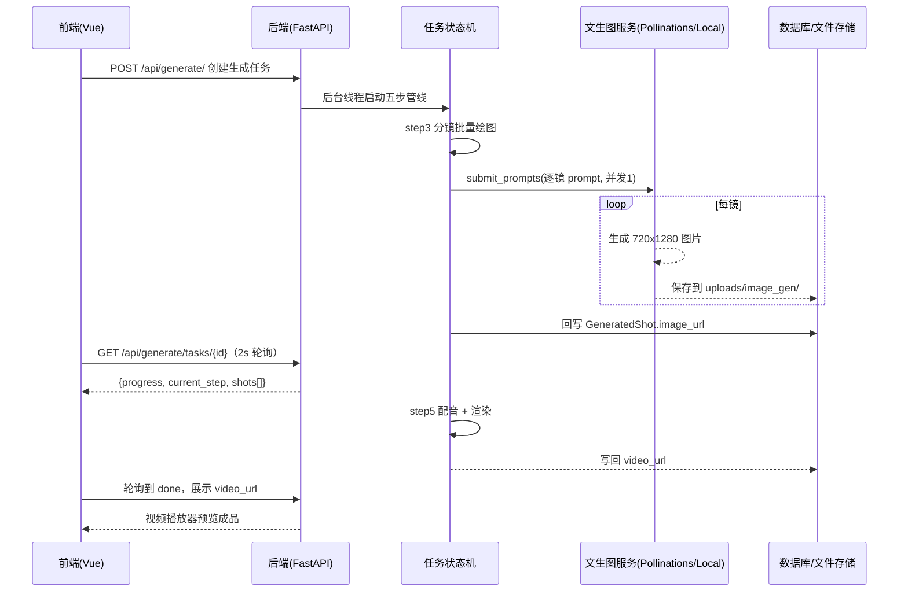

# 图 3-2 数据流向图 + 图 3-3 时序图（mermaid 源码）

## 图 3-2 核心业务数据流向（flow.png）

```mermaid
flowchart LR
    INPUT["用户输入：选择模板 + 填写变量"]
    SCRIPT["① 剧本自动合成（模板渲染）"]
    STORY["② 分镜脚本（8~18 镜）"]
    IMG["③ 分镜图片批量生成"]
    TTS["④ 配音合成（情绪语速）"]
    RENDER["⑤ Ken Burns 运镜 + 字幕烧录"]
    CONCAT["⑥ 完整漫剧视频（concat 拼接）"]
    OUT["输出：竖屏 MP4 + 预览页"]

    INPUT --> SCRIPT --> STORY --> IMG --> TTS --> RENDER --> CONCAT --> OUT
    STORY -.逐镜回传.-> IMG
```

## 图 3-3 AI 图像生成完整流程时序图（sequence.png）

```mermaid
sequenceDiagram
    participant FE as 前端(Vue)
    participant API as 后端(FastAPI)
    participant Q as 任务状态机
    participant GEN as 文生图服务(Pollinations/Local)
    participant DB as 数据库/文件存储

    FE->>API: POST /api/generate/ 创建生成任务
    API->>Q: 后台线程启动五步管线
    Q->>Q: step3 分镜批量绘图
    Q->>GEN: submit_prompts(逐镜 prompt, 并发1)
    loop 每镜
        GEN-->>GEN: 生成 720x1280 图片
        GEN-->>DB: 保存到 uploads/image_gen/
    end
    Q->>DB: 回写 GeneratedShot.image_url
    FE->>API: GET /api/generate/tasks/{id}（2s 轮询）
    API-->>FE: {progress, current_step, shots[]}
    Q->>Q: step5 配音 + 渲染
    Q-->>DB: 写回 video_url
    FE->>API: 轮询到 done，展示 video_url
    API-->>FE: 视频播放器预览成品
```

（mermaid.live 里分两个图分别导出：图 3-2 导出为 flow.png，图 3-3 导出为 sequence.png）
