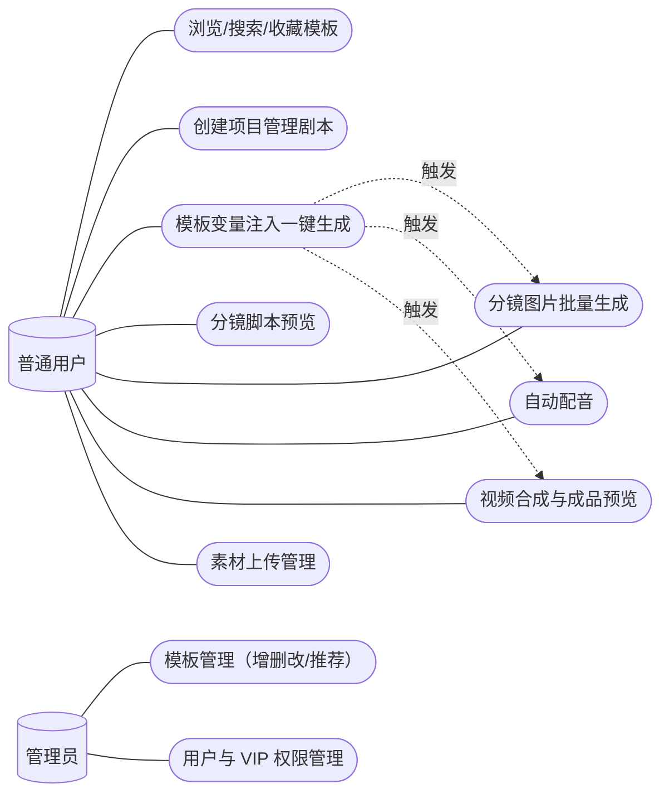

# 图 2-1 用例图（mermaid 源码，复制到 https://mermaid.live 导出 PNG 为 usecase.png）

```mermaid
flowchart LR
    U[("普通用户")]

    UC1(["浏览/搜索/收藏模板"])
    UC2(["创建项目管理剧本"])
    UC3(["模板变量注入一键生成"])
    UC4(["分镜脚本预览"])
    UC5(["分镜图片批量生成"])
    UC6(["自动配音"])
    UC7(["视频合成与成品预览"])
    UC8(["素材上传管理"])

    A[("管理员")]

    UC9(["模板管理（增删改/推荐）"])
    UC10(["用户与 VIP 权限管理"])

    U --- UC1
    U --- UC2
    U --- UC3
    U --- UC4
    U --- UC5
    U --- UC6
    U --- UC7
    U --- UC8

    A --- UC9
    A --- UC10

    UC3 -. 触发 .-> UC5
    UC3 -. 触发 .-> UC6
    UC3 -. 触发 .-> UC7
```
